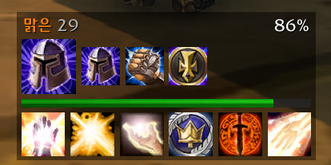
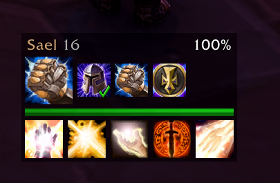

# BlessingBuddy

One-click buffs and rescue heals for players and pets **outside your group** in World of Warcraft: Forever.

Target a friendly stranger and BlessingBuddy shows a small bar with your single-target buffs, a recommended buff for the target's class, the target's health and a row of rescue heals.

  
  

## Download
- [CurseForge](https://www.curseforge.com/wow/addons/blessingbuddy)
- [GitHub Releases](../../releases)

## Features
- Recommended buff by target class, skips buffs the target already has
- Paladin one-blessing rule aware (refreshes instead of overwriting)
- Rescue row: heals, shields, dispels + target health bar
- Pets of other players: health bar, heals, Thorns
- Works in combat, keybinds, range/cooldown display, PvP warning
- Always casts your highest learned rank
- English and German interface

Supported classes: Paladin, Druid, Priest, Mage, Warlock, Shaman.

## Commands
| Command | Effect |
|---|---|
| `/bb move` | show the bar to move it (Shift + drag title) |
| `/bb reset` | reset position |
| `/bb debug` | diagnostic info about your target |

German aliases: `/segen move`, `/segen reset`, `/segen debug`.

## Reporting bugs
Please open an [issue](../../issues) and include your WoW version, class/level, the target and the output of `/bb debug`.

## Releasing (maintainers)
1. Update `CHANGELOG.md`
2. Commit, then tag: `git tag v1.2.7 && git push --tags`
3. The GitHub Action packages the addon with the [BigWigs packager](https://github.com/BigWigsMods/packager) and uploads it to CurseForge and GitHub Releases.

Requires the repository secret `CF_API_KEY` (CurseForge API token).

## License
MIT – see [LICENSE](LICENSE).
